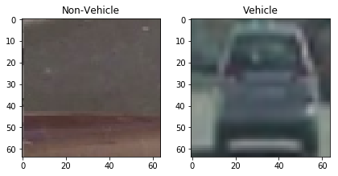
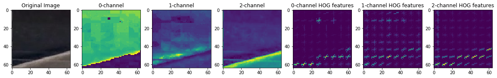
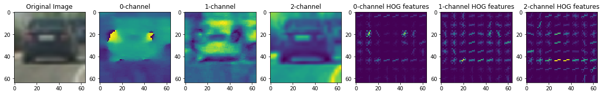

# Vehicle Detection

In this project I've described the steps to detect vehicles in a video. The steps of this project are the following:

* Perform a Histogram of Oriented Gradients (HOG) feature extraction on a labeled training set of images and train a classifier Linear SVM classifier
* Optionally, you can also apply a color transform and append binned color features, as well as histograms of color, to your HOG feature vector.
* Implement a sliding-window technique and use your trained classifier to search for vehicles in images.
* Run your pipeline on a video stream (project_video.mp4) and create a heat map of recurring detections frame by frame to reject outliers and follow detected vehicles.
* Estimate a bounding box for vehicles detected.

## Histogram of Oriented Gradients (HOG) feature extraction
I started by reading in all the `vehicle` and `non-vehicle` images that were shared as part of this project. Below an example of one of each of the `non-vehicle` and `vehicle` classes:

When loading the images using matplotlib.image the image will automatically be normalized. I then explored different color spaces and different parameters (`orientations`, `pixels_per_cell`, and `cells_per_block`). Here is an example using the `HSV` color space and HOG parameters of `orientations=9`, `pixels_per_cell=(8, 8)` and `cells_per_block=(2, 2)` of one of each of the `non-vehicle` and `vehicle` classes:

The final paramters are based on emperical results. I've tried multiple combinations of parameters and a couple of colour channels. Ideally I would have used a baysian parameter search or a grid search to test all different combinations, but unfortunately I'm short in time before the final deadline. 

The best result obtained so far was using 9 orientations, 8 pixel per cell, and 2 cell per blocks.

The code for reading the image and extracting the HOG features can be found in the notebook 'Vehicle tracking pipeline' in the 2nd and 3rd code block respectively. These steps are also made visually in the same notebook.

I trained a SVM with linear kernel using the SVC implementation in scikit learn (with all default paramters). This model showed a test accuracy of 0.991.

## Sliding-window technique
###Sliding Window Search

To detect car in our image, I've used a sliding window technique as described in the lessons. The code can be found in the 6th code block of the notebook 'Vehicle tracking pipeline'. 

My final model uses a window size of 64x64 and the model only searches the bottom of the image. We only use x-values between 375 and 675, because the top only represents the sky and some background and the bottom the front of the car. 

The final paramters are chosen based on emperical results (image and video results) with brute force techniques. Values between 16 and 64 have been tried for the window size. For the overlap we decided to go for 0.6 for the same reason (experimented with values between 0.5 x 0.8). The higher the overlap the more compute expensive the algorithms is. For example, 231 windows for an overlap of 0.5 and 1800 windows for an overlap of 0.8.

These images captured by the sliding windows function are resized before feeding into the classifier.

To keep track of the results, I've plotted the results on the test image after each iteration (see images below). Playing around with the hyperparamters and a custom threshold for the heatmap, I've visually detected improvements on the test images. When happy with the (intermediary) results, the results were also visually tested on the video.

## Video pipeline
To make my algorithm more robust for videos I've added some techniques to detect vehicles in subsequent frames. A heatmap (the code can be found in the 9th and 11th code block of the notebook 'Vehicle tracking pipeline' in the functions get_hot_windows and detect_vehicles respectively) is added to show the location of repeated vehicle detections. The previous results are stored in a custom class Memory, that stores values of the previous frame. This is used to reduce the number of false positives. 

To combine multiple overlapping boundig boxes I've added a function (draw_labeled_bboxes, found in the 11th code block) that combines all bounding boxes. The overlapping bounding boxes are extended to the min and max values so that a bigger bounding box is created.

## Output video
To process the video, I've created a function process_image. The output video can be downloaded from [here](output_video.mp4).

## Discussion
To improve the classifier:
* Try other algorithms
* Use an ensemble of methods (will increase accuracy, but at the same time also the time complexity)
* Add more training data or create augmentations of training data to make the model more robust
* Fine tune parameters

To reduce the number of false postives:
* Add other feature vectors
* Thresholding the decision function
* Hard negative mining

To improve the vehicle detection:
* Use (end-to-end) deep learning approach (SSD, YOLO, etc)
* Dynamically change the size of the sliding window function (the highter in the image the smaller the window, because the cars are further away)
